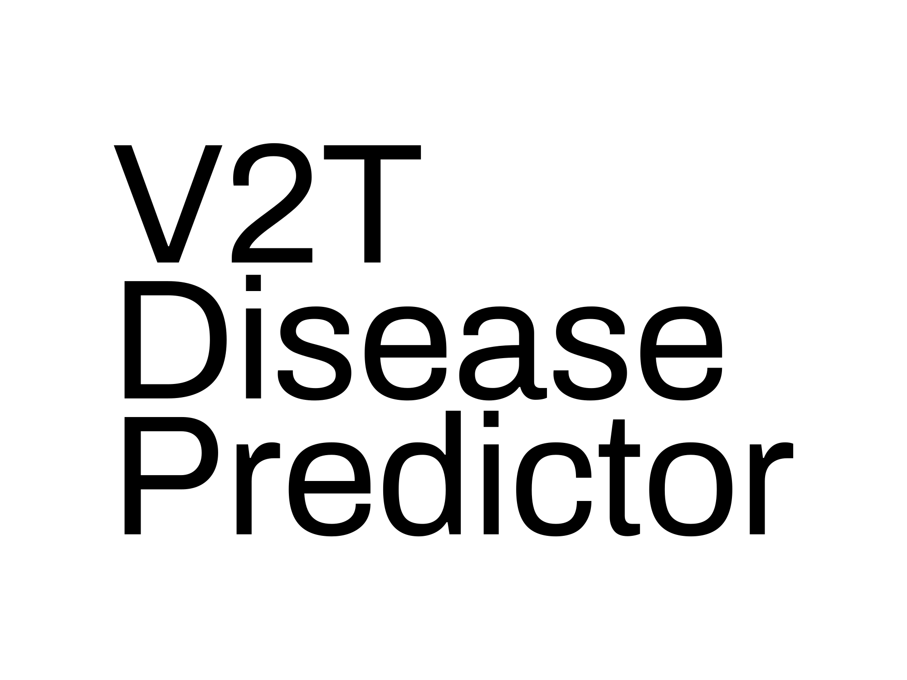

# V2T Disease Predictor

A machine learning-powered web application that predicts diseases based on user symptoms, supporting both text and voice input. The app leverages speech recognition and a trained ML model to provide quick, accessible health insights.

## Features

- Predicts diseases from user-provided symptoms
- Accepts both text and voice (speech-to-text) input
- User-friendly web interface
- Built with Python, Flask, and machine learning
- Utilizes a pre-trained model for fast predictions

## Demo



## Getting Started

### Prerequisites

- Python 3.7+
- pip

### Installation

1. Clone the repository:
   ```bash
   git clone https://github.com/yourusername/v2t-disease-predictor.git
   cd v2t-disease-predictor
   ```

2. Install dependencies:
   ```bash
   pip install -r requirements.txt
   ```

### Usage

Run the application:
```bash
python main.py
```

### Project Structure

```
Disease-prediction-from-Symptoms-with-ML-and-Speech-Recognition/
│
├── main.py
├── py3.py
├── model.pkl
├── requirements.txt
├── Training.csv
├── Testing.csv
├── static/
│   └── [images, icons, etc.]
├── templates/
│   └── index.html
└── README.md
```

### How It Works

- The user enters symptoms via text or voice.
- The app processes the input and predicts the most likely disease using a machine learning model.
- Results are displayed instantly on the web interface.

